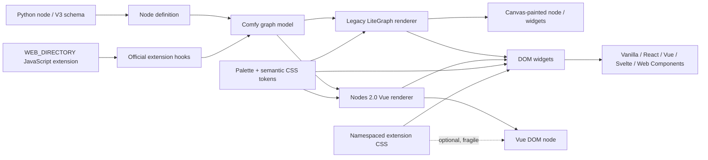
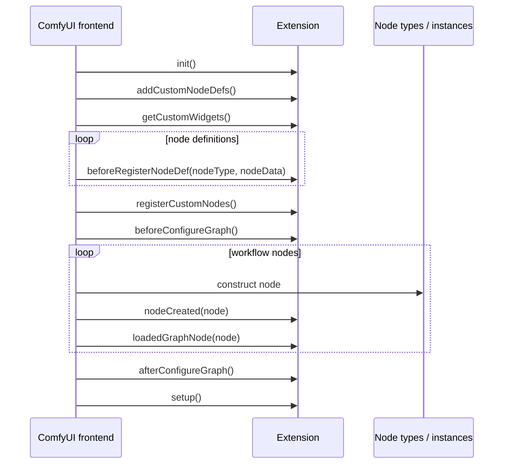
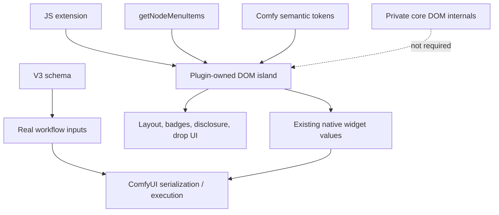

# Stylizing Nodes in ComfyUI: Custom Nodes and Advanced UI Techniques

## Executive summary

ComfyUI node styling in 2026 has to be understood as **two overlapping rendering systems plus an extension layer**, not as a single CSS surface. The legacy renderer is LiteGraph-centric: much of a node is painted onto a `<canvas>`, so CSS cannot directly restyle its body, ports, title, or Canvas2D widgets. Styling there is done through node properties such as `color`/`bgcolor`, LiteGraph widget APIs, `addCustomWidget`, and Canvas2D drawing hooks such as `onDrawForeground`. In the newer Nodes 2.0 renderer, nodes are real Vue-rendered DOM structures: the current `LGraphNode.vue` exposes a `.lg-node` outer element, `data-node-id`, `data-collapsed`, semantic Tailwind classes, DOM-rendered widgets, badges, footer/header components, and drag/drop/context-menu event handlers. citeturn21search3turn18view0turn18view2

The practical consequence is that **the most robust custom-node UI architecture is not “override ComfyUI’s CSS until it looks right.”** It is:

1. Define computation and native/dynamic inputs declaratively in Python, preferably using V3 schema features for new functionality.
2. Use the supported JavaScript extension hooks (`nodeCreated`, `beforeRegisterNodeDef`, `getCustomWidgets`, context-menu hooks, commands, sidebar/bottom-panel APIs) instead of prototype monkey-patching.
3. Use **DOM-widget or panel “islands” that you own**, namespace their CSS, and derive their colors from ComfyUI semantic CSS variables.
4. Use `node.color`/`node.bgcolor` when the whole node itself needs an accent.
5. Treat direct CSS selectors into Nodes 2.0 internals as an enhancement layer, not a compatibility contract.
6. Compile React/Vue/Svelte/etc. to ordinary browser assets and mount them only into DOM containers that ComfyUI deliberately hands to extensions. citeturn11search0turn11search1turn11search2turn12search0turn12search1

This distinction matters because the frontend is changing quickly. ComfyUI moved its frontend into the separate `ComfyUI_frontend` repository in August 2024; the current codebase is TypeScript/Vue, uses Vue 3 Composition API and Tailwind, and its contributor guidance explicitly recommends semantic styling tokens rather than dark-mode-specific overrides. LiteGraph has also been integrated directly into that repository since August 2025. citeturn10search1turn19view0

There is also real evidence of transition risk. An April 2026 frontend audit documented **four overlapping color systems**—design-system CSS variables, PrimeVue theme configuration, the color-palette service, and LiteGraph CSS—and called the resulting override chains fragile. A March 2026 compatibility report documents custom nodes whose `draw()` code, dynamic widgets, sizing, and links behaved differently under Nodes 2.0. An April 2026 rgthree report similarly records custom-widget rendering breaking after a frontend change. citeturn16view0turn14search2turn20search7

The highest-level recommendation is therefore:

| Strategy | Recommended role | Legacy LiteGraph | Nodes 2.0 | Update resilience |
|---|---|---:|---:|---:|
| Native Python input/output schema | Base UI and data contract | Excellent | Excellent | **Highest** |
| V3 `Autogrow` / `DynamicCombo` | Dynamic inputs and conditional sections | Frontend-dependent | Designed for current architecture | **High** |
| `node.color` / `node.bgcolor` | Whole-node accent/background | Good | Good; mapped into Vue node styles | **High** |
| Standard `addWidget` / `getCustomWidgets` | Lightweight custom controls | Good | Generally supported, test both | Medium-high |
| `addDOMWidget` + namespaced CSS | Rich node-local UI | Good | Good conceptual bridge | **Medium-high** |
| React/Vue/etc. mounted into owned DOM | Complex rich UI | Possible | Good as an isolated UI island | Medium |
| Canvas2D custom drawing | Dense legacy widgets, graphics | **Excellent** | Compatibility varies | Low-medium |
| CSS targeting `.lg-node` internals | Node 2.0 visual augmentation | N/A for canvas-painted pieces | Powerful | Low-medium |
| Prototype monkey-patching | Legacy hacks only | Possible | Fragile | **Low; avoid** |
| Global `:root` theme overrides | Theme packs/user customization | Broad | Broad | Medium, high blast radius |

The official migration direction supports this ranking: prototype hijacking is now explicitly described as deprecated and fragile; new context-menu hooks are declarative; and the V3 schema documentation states that future node-schema features will be added to V3. citeturn11search1turn11search2turn21search1



The rest of this report treats this architecture as the central design constraint.

## The ComfyUI styling surface

**Primary official references:** [Custom-node overview](https://docs.comfy.org/custom-nodes/overview), [JavaScript extensions](https://docs.comfy.org/custom-nodes/js/javascript_overview), [JavaScript hooks](https://docs.comfy.org/custom-nodes/js/javascript_hooks), [Comfy objects](https://docs.comfy.org/custom-nodes/js/javascript_objects_and_hijacking), [appearance and themes](https://docs.comfy.org/interface/appearance), [V3 migration](https://docs.comfy.org/custom-nodes/v3_migration), [official frontend repository](https://github.com/Comfy-Org/ComfyUI_frontend), and the current [`LGraphNode.vue`](https://github.com/Comfy-Org/ComfyUI_frontend/blob/main/src/renderer/extensions/vueNodes/components/LGraphNode.vue). ComfyUI's own custom-node overview describes the architecture as Python server plus JavaScript client. citeturn11search7

**The legacy surface.** The official object documentation still describes ComfyUI as being built on LiteGraph and exposes the graph, `LGraphCanvas`, canvas element, node widgets, display hooks, connections, and node state to extensions. Important node-side APIs include `addInput`, `removeInput`, `addWidget`, `addCustomWidget`, `addDOMWidget`, `setDirtyCanvas`, `onDrawBackground`, `onDrawForeground`, and `collapse`; important styling-related properties include `bgcolor`, `flags.collapsed`, and node sizing/state. citeturn21search3

This means legacy styling separates into two categories. A Canvas2D widget or node decoration is painted, so you style it procedurally:

```js
node.onDrawForeground = function (ctx) {
  ctx.save();
  ctx.font = "12px sans-serif";
  ctx.fillStyle = "#fff";
  ctx.fillText("Custom status", 12, 40);
  ctx.restore();
};
```

A DOM widget, by contrast, is ordinary HTML layered into the node and can use normal CSS:

```js
const panel = document.createElement("div");
panel.className = "acme-control-panel";
node.addDOMWidget("acme_panel", "acme_panel", panel);
```

The distinction is fundamental: a CSS selector cannot reach pixels already painted into a canvas. The official API's existence of separate Canvas2D draw hooks and `addDOMWidget` reflects those two rendering models. citeturn21search3

**The Nodes 2.0 surface.** The current Vue node component is materially different. Its outer element is focusable with `tabindex="0"` and currently carries `.lg-node`, `data-node-id`, `data-collapsed`, and `data-ghost`. It uses semantic classes such as `outline-node-component-outline` and `outline-node-stroke-executing`; it also registers `pointerdown`, `wheel`, `contextmenu`, `dragover`, `dragleave`, and `drop` handlers directly on the node DOM. citeturn18view0turn18view3

Inside that wrapper, the current renderer maps the node's stored color fields into the DOM:

```text
nodeData.color
    → header/background color

nodeData.bgcolor
    → --component-node-background
    → node body background
```

The body uses the semantic class `bg-component-node-background`, while the header uses `bg-node-component-header-surface`. The component hierarchy also currently contains `NodeHeader`, `NodeSlots`, `NodeWidgets`, `NodeContent`, `LivePreview`, `NodeBadges`, and `NodeFooter`. citeturn18view2

That makes `node.color` and `node.bgcolor` unusually valuable: they are among the few styling mechanisms that naturally bridge the legacy graph model into the newer DOM renderer.

**Theme architecture.** ComfyUI's public Appearance UI supports a color-palette system that can switch themes, export a palette as JSON, and import custom palette JSON. The official documentation explicitly warns that the palette structure is still being iterated and recommends exporting the current theme before modifying it rather than relying on copied historical schemas. For styling beyond the palette, frontend 1.20.5+ also supports a `user.css` file in the user's ComfyUI user directory. citeturn10search9

For extension authors, however, `user.css` is better understood as a **user/theme-author tool**, not a distribution mechanism. An extension should ship its own stylesheet under `WEB_DIRECTORY`; the official JavaScript-extension documentation states that `.js` files there are loaded automatically, while CSS and other resources are served under the extension path and must be included programmatically. citeturn11search0

A simple loader is:

```js
// web/index.js
const STYLE_ID = "acme-styled-nodes-css";

if (!document.getElementById(STYLE_ID)) {
  const link = document.createElement("link");
  link.id = STYLE_ID;
  link.rel = "stylesheet";

  // Because node.css is beside this JS module, URL resolution follows
  // the extension's served module URL rather than hard-coding its install path.
  link.href = new URL("./node.css", import.meta.url).href;

  document.head.append(link);
}
```

That `new URL(..., import.meta.url)` form is a normal ES-module-relative resource technique; the Comfy-specific requirement is that CSS is not automatically injected and must be served from the `WEB_DIRECTORY` extension path. citeturn11search0

**Current semantic tokens.** ComfyUI's frontend contributor rules now say to use Tailwind for core code and, crucially, to use semantic values from the design system instead of `dark:`/`dark-theme:` variants. The documentation gives `bg-node-component-surface` as an example. Current node code also exposes semantics such as `--component-node-background`, `node-component-header-surface`, `node-component-outline`, and `node-stroke-executing`. citeturn19view0turn18view2

For third-party CSS, the equivalent strategy is to consume those variables with fallbacks rather than reproduce ComfyUI's dark/light palette:

```css
.acme-node-ui {
  color: var(--node-component-header, var(--fg-color, #eee));
  background:
    var(--component-node-widget-background,
        var(--node-component-widget-input-surface, rgb(0 0 0 / 0.15)));
  border: 1px solid
    var(--node-component-border,
        var(--border-color, rgb(128 128 128 / 0.35)));
}
```

The fallback chain is intentional. ComfyUI's April 2026 audit found that the frontend currently has overlapping design-system variables, PrimeVue theme configuration, palette-service overrides, and LiteGraph CSS. This makes binding to a semantic purpose preferable to binding to a literal dark-theme color or private implementation class. citeturn16view0

A useful stability classification is:

| Styling target | Example | Use |
|---|---|---|
| **Your own class** | `.acme-node-ui`, `.acme-node-ui__badge` | Preferred |
| **Semantic CSS variable** | `var(--component-node-background)` | Preferred with fallback |
| **Graph node property** | `node.color`, `node.bgcolor` | Preferred for whole-node color |
| **Current Nodes 2.0 state attribute** | `.lg-node[data-collapsed]` | Conditional enhancement |
| **Current renderer class** | `.lg-node` | Use sparingly |
| **Tailwind utility on core internals** | `.bg-component-node-background` | Do not depend on DOM location |
| **Test selector** | `[data-testid="node-inner-wrapper"]` | **Never use for production styling** |
| **Generated/build class** | implementation-specific hashed class | **Avoid** |

`.lg-node`, the node data attributes, and `data-testid` values above exist in the current source, but only the extension APIs—not arbitrary internal DOM details—should be treated as a public compatibility contract. citeturn18view0turn18view2

For example, this can be a reasonable optional Nodes 2.0 enhancement:

```css
/* Scope the rule aggressively. Do not restyle every ComfyUI node. */
.lg-node[data-acme-enhanced="true"][data-collapsed="true"] {
  filter: saturate(0.9);
}
```

A stronger design is to style **the extension's own child**:

```css
.acme-node-ui {
  container-type: inline-size;
}

.acme-node-ui__grid {
  display: grid;
  grid-template-columns: 1fr auto;
  gap: 0.4rem;
}

@container (max-width: 220px) {
  .acme-node-ui__grid {
    grid-template-columns: 1fr;
  }
}
```

SCSS adds no Comfy-specific runtime capabilities: browsers ultimately need CSS. Therefore SCSS is most appropriate in a Vite/webpack/Rollup build where it is compiled to a CSS artifact before distribution. The official React extension template already establishes a build-to-`dist` pattern; a Vue, Svelte, Solid, Preact, or SCSS-based extension can use the same general artifact model. citeturn13search1

## Custom-node UI architecture and extension APIs

A custom node has **two conceptually independent classes**: the Python node definition that describes executable inputs/outputs, and the browser-side graph node instance that renders/interacts with them. ComfyUI's official overview explicitly separates server-side Python work from client-side JavaScript UI. citeturn11search7

For new backend features, the V3 schema is strategically important. V3 nodes inherit from `io.ComfyNode`, define their user-visible contract through `define_schema()`, execute through a class method named `execute`, and are exposed through a `ComfyExtension` entry point. The V3 migration documentation says future extensions to node-schema features will only be added to V3. citeturn21search1

A minimal V3 shape looks like:

```python
from comfy_api.latest import ComfyExtension, io


class StyledMultiply(io.ComfyNode):
    @classmethod
    def define_schema(cls) -> io.Schema:
        return io.Schema(
            node_id="AcmeStyledMultiply",
            display_name="Styled Multiply",
            category="Acme/UI",
            inputs=[
                io.Float.Input("value", default=1.0),
                io.Float.Input("factor", default=2.0),
            ],
            outputs=[
                io.Float.Output(display_name="result"),
            ],
        )

    @classmethod
    def execute(cls, value: float, factor: float) -> io.NodeOutput:
        return io.NodeOutput(value * factor)


class AcmeExtension(ComfyExtension):
    async def get_node_list(self):
        return [StyledMultiply]


async def comfy_entrypoint():
    return AcmeExtension()
```

The V3 documentation currently describes `comfy_api.latest` as the development-facing API pointer and recommends a numbered API when stability against future API development is more important. That distinction is worth respecting in widely distributed node packs. citeturn21search1

**Dynamic UI should increasingly begin in the schema, not in a drawing hack.** V3 has `Autogrow`, which represents a variable number of inputs that expands as connections are made, and `DynamicCombo`, whose selected option can reveal a different set of inputs; the latter can even nest. The documentation explicitly says these dynamic input types have no V1 equivalent. citeturn21search1

For example:

```python
@classmethod
def define_schema(cls):
    return io.Schema(
        node_id="AcmeResize",
        display_name="Smart Resize",
        category="Acme/Image",
        inputs=[
            io.Image.Input("image"),
            io.DynamicCombo.Input(
                "mode",
                options=[
                    io.DynamicCombo.Option(
                        "dimensions",
                        [
                            io.Int.Input("width", default=1024, min=64),
                            io.Int.Input("height", default=1024, min=64),
                        ],
                    ),
                    io.DynamicCombo.Option(
                        "scale",
                        [
                            io.Float.Input(
                                "factor",
                                default=1.0,
                                min=0.1,
                                max=8.0,
                            )
                        ],
                    ),
                ],
            ),
        ],
        outputs=[io.Image.Output()],
    )
```

That approach is much safer than manually adding/removing arbitrary visual controls and then inventing custom workflow-serialization semantics.

For frontend behavior, the central entry point is:

```js
import { app } from "../../scripts/app.js";

app.registerExtension({
  name: "acme.styled-nodes",
  // hooks...
});
```

A Python package exposes a `WEB_DIRECTORY`; every JavaScript file under it is loaded as ComfyUI initializes. citeturn11search0

The most relevant hooks are:

| Hook/API | Appropriate use | Stability advice |
|---|---|---|
| `getCustomWidgets` | Register a widget type | Preferred |
| `beforeRegisterNodeDef` | Type-level behavior before a node class is registered | Use sparingly; avoid prototype hacks |
| `nodeCreated` | Add per-instance UI/properties | **Best general node-styling hook** |
| `beforeConfigureGraph` | Prepare before workflow deserialization | Supported |
| `afterConfigureGraph` | Work after a workflow is fully loaded | Preferred over `setup` for workflow-dependent logic |
| `setup` | Global listeners/menu/panel initialization | Good |
| `getNodeMenuItems` | Node context menu entries | **Preferred** |
| `getCanvasMenuItems` | Canvas menu entries | **Preferred** |
| `commands` / `keybindings` | Keyboard-accessible extension actions | Preferred |
| `getSelectionToolboxCommands` | Actions associated with selected graph items | Preferred |

These hooks and their initialization sequence are documented officially. citeturn11search1turn10search15turn11search2turn22search0turn21search0

The approximate extension sequence on initial load is:



This ordering comes directly from the official hooks documentation. Notably, simply adding a new node later generally invokes `nodeCreated`, which makes it the natural place to attach per-instance visual UI. citeturn11search1

A minimal styling hook therefore looks like:

```js
app.registerExtension({
  name: "acme.node-accent",

  nodeCreated(node) {
    if (node.comfyClass !== "AcmeStyledMultiply") return;

    // These graph-level colors bridge legacy and Nodes 2.0 better
    // than reaching deeply into either renderer's private DOM.
    node.color = "#3b5368";
    node.bgcolor = "#1f2b35";
  },
});
```

In current Nodes 2.0 source, those properties feed the header/background and `--component-node-background`; in the legacy graph they are standard node color state. citeturn21search3turn18view2

For rich node-local UI, `addDOMWidget` is the most important bridge:

```js
nodeCreated(node) {
  if (node.comfyClass !== "AcmeStyledMultiply") return;

  const element = document.createElement("section");
  element.className = "acme-node-ui";
  element.innerHTML = `
    <div class="acme-node-ui__header">
      <span class="acme-node-ui__badge">ACME</span>
      <span>Advanced controls</span>
    </div>
  `;

  const widget = node.addDOMWidget(
    "acme_ui",
    "acme_ui",
    element
  );

  // UI-only data should not accidentally become an execution input.
  if (widget) widget.serialize = false;
}
```

`addDOMWidget` is explicitly part of the documented node object surface. citeturn21search3

There is no special ComfyUI HTML-template language that extension authors must use. Legacy custom widgets typically expose JavaScript classes with procedural `draw`/event logic; DOM extensions construct HTML directly; sidebar and bottom-panel APIs receive an element through `render(el)`; React uses JSX; Vue can use SFC `<template>` blocks after compilation. The ComfyUI core itself now uses Vue SFC templates for Nodes 2.0. citeturn18view0turn12search0turn12search1

That distinction answers an often-confusing question: **you do not “replace the node's Vue template” through a stable extension API.** Instead, you contribute graph state/widgets and mount your own DOM/component UI into supported extension surfaces.

## Styling strategies, frameworks, and advanced interaction patterns

The safest CSS architecture is a **three-layer token system**:

```css
/* Layer A: plugin-owned semantic tokens */
.acme-node-ui {
  --acme-surface:
    var(--component-node-widget-background,
        var(--node-component-widget-input-surface, #222));
  --acme-text:
    var(--node-component-header,
        var(--input-text, #ddd));
  --acme-border:
    var(--node-component-border,
        var(--border-color, #555));

  color: var(--acme-text);
  background: var(--acme-surface);
}

/* Layer B: internal components only depend on plugin variables */
.acme-node-ui__section {
  border: 1px solid var(--acme-border);
  border-radius: 0.5rem;
}

/* Layer C: state */
.acme-node-ui[data-status="running"] {
  --acme-border:
    var(--node-stroke-executing, currentColor);
}
```

This insulates the bulk of your CSS from both ComfyUI token renames and your own design changes. It also prevents a plugin from overriding `:root` and unexpectedly recoloring every node in the graph. The rationale is reinforced by ComfyUI's current semantic-token guidance and the documented layering problem in the active theme architecture. citeturn19view0turn16view0

**Direct Nodes 2.0 selectors are useful for diagnostics and narrowly scoped enhancements, not for primary layout.** The current DOM makes selectors like these technically possible:

```css
/* Current Nodes 2.0 DOM — implementation-sensitive. */
.lg-node[data-collapsed="true"] { /* ... */ }

.lg-node[data-ghost="true"] { /* ... */ }

.lg-node[data-node-id="42"] { /* debugging only */ }
```

The attributes and `.lg-node` class are present today in `LGraphNode.vue`. Because they are renderer internals, an extension should never depend on exact child ordering or on `data-testid` values for production styling. citeturn18view0turn18view2

### Framework integration in practice

Although ComfyUI's core frontend is Vue, an extension does **not** have to use Vue. Sidebar and bottom-panel APIs are intentionally DOM-based: ComfyUI hands a `render` function an `HTMLElement`. The official docs explicitly demonstrate mounting React with `ReactDOM.createRoot()` into both surfaces. citeturn12search0turn12search1

The official [ComfyUI React Extension Template](https://github.com/Comfy-Org/ComfyUI-React-Extension-Template) uses React, TypeScript, Vite, internationalization, and `@comfyorg/comfyui-frontend-types`; it separates source under `ui/` from compiled `dist/` artifacts and provides build/publishing automation. citeturn13search1turn13search2

A React island therefore looks conceptually like:

```tsx
import React from "react";
import { createRoot } from "react-dom/client";

export function mountControl(host: HTMLElement) {
  const root = createRoot(host);

  root.render(
    <React.StrictMode>
      <NodeControlPanel />
    </React.StrictMode>
  );

  return () => root.unmount();
}
```

The same container architecture works technically with Vue `createApp`, Svelte `mount`, Preact, Solid, Lit, or Web Components because ComfyUI's outer contract is simply a DOM element. That portability is an inference from the official `render(el)`/DOM-widget APIs, rather than a promise that ComfyUI integrates each framework's state machinery. citeturn12search0turn12search1turn21search3

There is an important 2026 caveat for Vue in particular. An open frontend issue documents that a Vite-built extension can bundle a **different Vue runtime** from ComfyUI itself. Such a component can be perfectly reactive inside its own mounted island, but its refs/computed values are not automatically tracked by ComfyUI's internal Vue runtime. The issue specifically reports problems when extension reactivity is passed into frontend-managed constructs such as node badges. citeturn13search0

That yields a useful boundary:

```text
GOOD
extension Vue/React state
        ↓
extension-owned DOM root
        ↓
extension-owned components

RISKY
extension Vue ref
        ↓
ComfyUI internal Vue computed/watch
        ↓
core renderer component
```

The official custom-node overview also points developers to a community `ComfyUI_frontend_vue_basic` example, and the current community implementation demonstrates Vue/PrimeVue/vue-i18n inside a custom-node frontend. It is useful as a learning example, but it should not be interpreted as granting access to ComfyUI's internal Vue app/runtime. citeturn11search7turn13search3

### Advanced interaction patterns

**Dynamic inputs.** Prefer V3 `Autogrow` for variable-length ports and `DynamicCombo` for conditional parameter groups. Manual `addInput`/`removeInput` remains available through the graph node API, but it increases the amount of serialization, reconnection, subgraph, renderer, and compatibility behavior that your extension owns. citeturn21search1turn21search3

**Collapsible UI.** For the whole graph node, ComfyUI exposes `flags.collapsed` and `collapse()`. For a section *inside* a DOM widget, native `<details>/<summary>` is often superior to custom JavaScript because it gives you disclosure behavior, keyboard interaction, and `open` state semantics with very little code. citeturn21search3

```html
<details class="acme-node-ui__details">
  <summary>Advanced</summary>
  <div class="acme-node-ui__advanced">
    ...
  </div>
</details>
```

**Drag and drop.** Nodes 2.0 currently has explicit `dragover`, `dragleave`, and `drop` handling on the node component itself. For an extension-owned DOM widget, standard browser drag/drop is the least coupled mechanism; stop propagation only where the widget actually consumes the drop so the graph still receives unrelated gestures. citeturn18view3

```js
dropzone.addEventListener("dragover", (event) => {
  event.preventDefault();
  dropzone.dataset.dragging = "true";
});

dropzone.addEventListener("dragleave", () => {
  delete dropzone.dataset.dragging;
});

dropzone.addEventListener("drop", (event) => {
  event.preventDefault();
  delete dropzone.dataset.dragging;

  const file = event.dataTransfer?.files?.[0];
  if (file) {
    filename.textContent = file.name;
  }
});
```

For actual upload integration, copy the architecture of current core upload widgets rather than inventing a new workflow-data representation.

**Context menus.** This is one of the clearest API migrations. The old technique of wrapping `LGraphCanvas.prototype.getCanvasMenuOptions` or `nodeType.prototype.getExtraMenuOptions` is now deprecated. Extensions should return menu entries from `getCanvasMenuItems(canvas)` or `getNodeMenuItems(node)`, including conditional items, separators, and declarative submenus. citeturn11search2

```js
app.registerExtension({
  name: "acme.node-menu",

  getNodeMenuItems(node) {
    if (node.comfyClass !== "AcmeStyledMultiply") return [];

    return [
      null,
      {
        content: "ACME",
        submenu: {
          options: [
            {
              content: "Reset visual state",
              callback: () => resetVisualState(node),
            },
            {
              content: "Toggle compact UI",
              callback: () => toggleCompact(node),
            },
          ],
        },
      },
    ];
  },
});
```

**Selection actions.** For actions that conceptually operate on a selected node rather than being part of its body, the Selection Toolbox is cleaner than adding another tiny node button. Extensions define a command and expose its ID from `getSelectionToolboxCommands`; visibility can change based on the current selection. citeturn21search0

**Commands, menus, and keyboard access.** ComfyUI has first-class command and keybinding APIs, and the same command IDs can be surfaced through topbar menus. Core shortcuts cannot be replaced by extensions, browser-reserved shortcuts may be unavailable, and duplicate extension bindings have undefined behavior. citeturn22search0turn22search1

**Icons.** Core contributor guidance currently supports PrimeIcons, Iconify/Tailwind icon classes, and custom SVG icons. Extension-facing APIs such as sidebars and selection-toolbox commands accept icon classes. For distributed node-local DOM widgets, shipping an inline SVG or a small plugin-owned icon set is often less brittle than assuming every icon library class used internally will remain globally available. citeturn19view0turn12search1turn21search0

**Badges.** There is a stable documented `aboutPageBadges` API for extension metadata on ComfyUI's About page. Nodes 2.0 also internally renders `NodeBadges`; however, the 2026 dual-Vue-runtime issue specifically uses reactive `node.badges` as an example of a public-API boundary problem. For node-local state/status, a badge inside your own DOM widget is currently the lower-risk solution. citeturn22search4turn18view2turn13search0

```html
<span class="acme-node-ui__badge"
      role="status"
      aria-live="polite">
  Ready
</span>
```

**Animations.** Keep animation inside extension-owned DOM and favor `transform`/`opacity` over repeated node re-layout. Always include reduced-motion handling:

```css
.acme-node-ui__activity {
  transition: opacity 140ms ease, transform 140ms ease;
}

@media (prefers-reduced-motion: reduce) {
  .acme-node-ui *,
  .acme-node-ui *::before,
  .acme-node-ui *::after {
    scroll-behavior: auto;
    transition-duration: 0.001ms;
    animation-duration: 0.001ms;
    animation-iteration-count: 1;
  }
}
```

Canvas animation is more expensive architecturally because it normally requires dirtifying/repainting the graph repeatedly. The official `setDirtyCanvas` API exists for explicit repaints, so use it only when visual state actually changes rather than on an unconditional permanent animation loop. citeturn21search3

**Responsive layout.** DOM widgets can use Grid, Flexbox, `ResizeObserver`, and container queries; avoid basing internal breakpoints on viewport width because a node can be 180px wide on a 4K monitor. The node's own inline size is the relevant constraint.

**Accessibility.** Prefer native `<button>`, `<input>`, `<select>`, `<details>`, associated labels, `aria-expanded` where needed, and visible `:focus-visible` states. Nodes 2.0 itself is now DOM-focusable, and a 2025 accessibility issue specifically identified the loss of a clear text-area focus outline as problematic. That is a useful warning not to “clean up” focus rings merely for aesthetics. citeturn18view0turn14search0

```css
.acme-node-ui button:focus-visible,
.acme-node-ui input:focus-visible {
  outline: 2px solid
    var(--node-stroke-executing, Highlight);
  outline-offset: 2px;
}
```

Canvas-only custom controls are intrinsically harder to make keyboard- and assistive-technology-friendly because there is no corresponding semantic DOM control. For complex interaction, this is another strong reason to prefer a DOM widget.

**Localization.** Custom node packages can ship a root `locales/` directory containing `main.json`, `nodeDefs.json`, `settings.json`, and `commands.json` under language directories. `nodeDefs.json` can localize node display names, descriptions, inputs, tooltips, options, and outputs. The current documented language set includes English, Simplified and Traditional Chinese, French, Korean, Russian, Spanish, Japanese, and Arabic. citeturn11search3

For framework-owned UI, keep its strings in the framework's own i18n layer unless you deliberately bridge to ComfyUI. The official React template includes its own internationalization setup, while core frontend contributor rules require `vue-i18n` for core user-facing strings. citeturn13search1turn19view0

## Community implementations and what they teach

The best community repositories are valuable not because every implementation should be copied, but because they expose the limits of the API under real workloads.

**[rgthree-comfy](https://github.com/rgthree/rgthree-comfy)** is one of the strongest examples of dense, highly customized LiteGraph-era node UX. Its Power LoRA Loader lets users add an effectively variable number of LoRA rows, compactly toggle rows, adjust one or separate model/CLIP strengths, reorder/delete rows through right-click actions, and retain a compact presentation. citeturn20search2

The current TypeScript implementation is worth reading directly: [`src_web/comfyui/power_lora_loader.ts`](https://github.com/rgthree/rgthree-comfy/blob/main/src_web/comfyui/power_lora_loader.ts). It uses custom widget classes, canvas drawing helpers, `addCustomWidget`, dynamic row insertion, size recomputation, explicit canvas dirtification, and custom context-menu logic. In simplified form, the architectural pattern is:

```js
// Simplified illustration of the rgthree pattern.
const widget = node.addCustomWidget(new CustomRowWidget());
node.setDirtyCanvas(true, true);
```

The lesson is two-sided. This approach achieves extraordinary pixel density in the legacy renderer, but its bespoke Canvas2D/event behavior creates a larger compatibility surface. A 2026 rgthree issue records promoted Power LoRA widgets becoming invisible after a frontend/subgraph rendering change. citeturn20search7

Its older context-menu tricks should especially be treated as historical technique, because ComfyUI now has a dedicated declarative context-menu API. citeturn11search2

**[ComfyUI Impact Pack](https://github.com/comfyorg/comfyui-impact-pack)** demonstrates a different high-value pattern: use the node/context menu as an entry point into a larger specialized UI rather than cramming the entire application into the node. Its Interactive SAM Detector adds an “Open in SAM Detector” action for suitable image/mask nodes and opens an interactive dialog where positive/negative points and mask parameters can be manipulated before applying the result back to the node. citeturn20search6

That pattern generalizes well:

```text
node
  │
  ├── basic parameters stay compact
  │
  └── "Open advanced editor…"
          ↓
      modal / sidebar / panel
          ↓
      large interactive UI
          ↓
      write result back to node
```

For editors, galleries, curves, model browsers, timeline controls, mask painters, or complex table UIs, this is usually better UX and better performance than creating 500–1000 DOM elements inside every visible graph node.

**[ComfyUI-Easy-Use-Frontend](https://github.com/yolain/ComfyUI-Easy-Use-Frontend)** is useful as an example of treating frontend code as a compiled product. Its separate frontend repository uses npm/Vite, produces a built bundle for the parent node pack, beautifies context-menu behavior, adds node statistics and shortcuts, and redesigns specific node UIs. Its README is explicit that its newer frontend depends on newer ComfyUI APIs and cannot support old versions indefinitely. citeturn20search4

That explicit version boundary is healthier than silently relying on whichever internal frontend objects happen to exist.

**[ComfyUI-Lora-Manager](https://github.com/willmiao/ComfyUI-Lora-Manager)** illustrates a further scaling pattern: large model-management experiences need not be node-sized. Its repository combines ComfyUI node integration with a richer management UI, previews, menus, model metadata, workflow integration, and frontend testing. citeturn20search0

**[ComfyUI-React-Extension-Template](https://github.com/Comfy-Org/ComfyUI-React-Extension-Template)** is the reference to prefer when starting a framework build today because it is under Comfy-Org, uses official frontend TypeScript types, has build/test/i18n scaffolding, and demonstrates how compiled assets are included in registry publishing. citeturn13search1

The official docs also list a Vue example, [`jtydhr88/ComfyUI_frontend_vue_basic`](https://github.com/jtydhr88/ComfyUI_frontend_vue_basic), demonstrating a drawing-board-like custom node with Vue/PrimeVue/i18n. It is instructive as a framework island, particularly when read alongside the open dual-runtime issue described earlier. citeturn11search7turn13search0

The community evidence produces a clear architectural progression:

| Pattern | Good example | Strength | Main liability |
|---|---|---|---|
| Dense Canvas2D custom widget | rgthree Power LoRA Loader | Maximum density/control | Renderer coupling |
| Node → advanced modal editor | Impact Pack SAM | Keeps graph compact | Requires dialog/state plumbing |
| Bundled modern frontend | Easy-Use | Maintainable large UI | API/version boundary required |
| Large external/panel UI plus node integration | LoRA Manager | Scales to large datasets | More application complexity |
| Typed framework extension | Official React template | Modern tooling/testing | Bundle and lifecycle overhead |

These repositories also demonstrate why compatibility testing needs to be treated as part of UI engineering rather than an afterthought. A March 2026 frontend issue reports a custom toolkit where legacy `draw()` code ceased working in Nodes 2.0, dynamically populated controls remained stuck at “Loading…”, link geometry became incorrect, and custom sizing assumptions diverged between renderers. citeturn14search2

## Reference implementations and packaging

A maintainable distributable node pack should separate **Python execution**, **frontend source**, and **browser-ready artifacts**.

For a small vanilla-JS extension, a strong layout is:

```text
comfyui-acme-styled/
├── __init__.py
├── nodes.py
├── pyproject.toml
├── README.md
├── LICENSE
│
├── locales/
│   ├── en/
│   │   ├── nodeDefs.json
│   │   ├── main.json
│   │   └── commands.json
│   └── es/
│       ├── nodeDefs.json
│       ├── main.json
│       └── commands.json
│
├── web/                         # WEB_DIRECTORY
│   ├── index.js
│   ├── node.css
│   ├── icons/
│   │   └── status.svg
│   └── docs/
│       ├── AcmeStyledNode.md
│       └── AcmeStyledNode/
│           ├── en.md
│           └── es.md
│
├── tests/
│   ├── test_nodes.py
│   └── frontend/
│
└── .github/
    └── workflows/
        └── publish_action.yml
```

The root `locales/` arrangement follows the custom-node i18n specification; node documentation belongs inside `WEB_DIRECTORY/docs`, with optional locale-specific Markdown. citeturn11search3turn22search7

For a built frontend:

```text
comfyui-acme-styled/
├── __init__.py
├── backend/
│   ├── __init__.py
│   └── nodes.py
├── pyproject.toml
│
├── frontend/                    # source only
│   ├── src/
│   │   ├── index.ts
│   │   ├── components/
│   │   ├── styles/
│   │   └── i18n/
│   ├── package.json
│   ├── tsconfig.json
│   └── vite.config.ts
│
├── web/                         # generated browser artifacts
│   ├── index.js
│   ├── index.css
│   └── assets/
│
├── locales/
├── tests/
└── .github/workflows/
```

Alternatively, use `dist/` rather than `web/`; the official React template uses a compiled `dist/` and explicitly includes it during registry packaging. citeturn13search1

The key rule is **one browser distribution directory**. Do not make ComfyUI import your raw `src/*.tsx`/`.vue`/`.scss`; compile framework code and SCSS ahead of publication.

The Comfy Registry uses `pyproject.toml` metadata, including project name/version and `[tool.comfy]` publisher information. Official publishing supports the Comfy CLI and a GitHub Action; published versions use semantic versioning and are immutable in the registry. citeturn10search0turn10search4turn10search14

A representative package file is:

```toml
[project]
name = "comfyui-acme-styled"
description = "Styled custom nodes and UI extensions for ComfyUI"
version = "0.1.0"
dependencies = []

[project.urls]
Repository = "https://github.com/acme/comfyui-acme-styled"

[tool.comfy]
PublisherId = "acme"
DisplayName = "ACME Styled Nodes"

# When a generated frontend directory needs explicit inclusion:
includes = ["web/"]
```

Registry standards also prohibit unsafe practices such as runtime `pip` installation through subprocesses and `eval`/`exec`-based arbitrary execution. citeturn10search13

### Minimal implementation

This example deliberately uses a conventional V1 backend because it keeps the Python side familiar while concentrating on the frontend styling mechanics. For new schema-level functionality, use the V3 equivalent described earlier.

`__init__.py`:

```python
from .nodes import StyledText

NODE_CLASS_MAPPINGS = {
    "AcmeStyledText": StyledText,
}

NODE_DISPLAY_NAME_MAPPINGS = {
    "AcmeStyledText": "Styled Text",
}

# Browser files are served from here.
WEB_DIRECTORY = "./web"

__all__ = [
    "NODE_CLASS_MAPPINGS",
    "NODE_DISPLAY_NAME_MAPPINGS",
    "WEB_DIRECTORY",
]
```

Exporting `WEB_DIRECTORY` this way is the documented JavaScript-extension mechanism. citeturn11search0

`nodes.py`:

```python
class StyledText:
    @classmethod
    def INPUT_TYPES(cls):
        return {
            "required": {
                "text": (
                    "STRING",
                    {
                        "default": "Hello from ACME",
                        "multiline": True,
                    },
                )
            }
        }

    RETURN_TYPES = ("STRING",)
    RETURN_NAMES = ("text",)
    FUNCTION = "run"
    CATEGORY = "Acme/UI"

    def run(self, text):
        return (text,)
```

`web/index.js`:

```js
import { app } from "../../scripts/app.js";

const NODE_CLASS = "AcmeStyledText";

/**
 * Load plugin CSS once.
 */
function ensureStyles() {
  const id = "acme-styled-text-css";
  if (document.getElementById(id)) return;

  const link = document.createElement("link");
  link.id = id;
  link.rel = "stylesheet";
  link.href = new URL("./node.css", import.meta.url).href;
  document.head.append(link);
}

app.registerExtension({
  name: "acme.styled-text",

  async setup() {
    ensureStyles();
  },

  async nodeCreated(node) {
    if (node.comfyClass !== NODE_CLASS) return;

    /*
     * Whole-node colors.
     * This is preferable to searching the Nodes 2.0 DOM and changing
     * private header/body children directly.
     */
    node.color = "#40566c";
    node.bgcolor = "#24313d";

    /*
     * Rich content is kept inside a plugin-owned DOM island.
     */
    const root = document.createElement("div");
    root.className = "acme-node-ui";
    root.innerHTML = `
      <div class="acme-node-ui__row">
        <span class="acme-node-ui__badge">ACME</span>
        <span class="acme-node-ui__label">
          Styled Text
        </span>
      </div>
    `;

    const widget = node.addDOMWidget(
      "acme_status",
      "acme_status",
      root
    );

    // Pure presentation should not accidentally become execution data.
    if (widget) {
      widget.serialize = false;
    }
  },
});
```

The extension lifecycle, `nodeCreated`, and `addDOMWidget` are supported surfaces documented by ComfyUI. citeturn11search1turn21search3

`web/node.css`:

```css
.acme-node-ui {
  --acme-surface:
    var(--component-node-widget-background,
        var(--node-component-widget-input-surface, rgb(0 0 0 / 0.14)));

  --acme-text:
    var(--node-component-header,
        var(--input-text, #eee));

  --acme-border:
    var(--node-component-border,
        var(--border-color, rgb(255 255 255 / 0.18)));

  box-sizing: border-box;
  width: 100%;
  padding: 0.45rem 0.55rem;

  color: var(--acme-text);
  background: var(--acme-surface);

  border: 1px solid var(--acme-border);
  border-radius: 0.5rem;

  font: inherit;
}

.acme-node-ui__row {
  display: flex;
  align-items: center;
  gap: 0.45rem;
}

.acme-node-ui__badge {
  flex: none;
  padding: 0.1rem 0.35rem;

  border: 1px solid var(--acme-border);
  border-radius: 999px;

  font-size: 0.7em;
  font-weight: 700;
  letter-spacing: 0.04em;
}

.acme-node-ui__label {
  min-width: 0;
  overflow: hidden;
  text-overflow: ellipsis;
  white-space: nowrap;
}
```

This sample has only one dependency on renderer-specific styling: semantic CSS variables, with fallbacks. The element structure itself is owned by the extension.

### Advanced implementation

The next example combines a V3 conditional schema with a rich node-local DOM island, a collapsible section, responsive layout, drop target, status badge, and the supported context-menu hook.

Backend:

```python
from comfy_api.latest import ComfyExtension, io


class AdvancedStyledNode(io.ComfyNode):
    @classmethod
    def define_schema(cls):
        return io.Schema(
            node_id="AcmeAdvancedStyled",
            display_name="Advanced Styled Node",
            category="Acme/UI",
            inputs=[
                io.String.Input(
                    "label",
                    default="Untitled",
                ),

                io.DynamicCombo.Input(
                    "operation",
                    options=[
                        io.DynamicCombo.Option(
                            "simple",
                            [
                                io.Float.Input(
                                    "strength",
                                    default=1.0,
                                    min=0.0,
                                    max=2.0,
                                ),
                            ],
                        ),
                        io.DynamicCombo.Option(
                            "advanced",
                            [
                                io.Float.Input(
                                    "strength",
                                    default=1.0,
                                    min=0.0,
                                    max=2.0,
                                ),
                                io.Float.Input(
                                    "bias",
                                    default=0.0,
                                    min=-1.0,
                                    max=1.0,
                                ),
                            ],
                        ),
                    ],
                ),
            ],
            outputs=[
                io.String.Output(display_name="summary"),
            ],
        )

    @classmethod
    def execute(cls, label, operation):
        mode = operation["operation"]
        return io.NodeOutput(f"{label}: {mode}")


class AcmeExtension(ComfyExtension):
    async def get_node_list(self):
        return [AdvancedStyledNode]


async def comfy_entrypoint():
    return AcmeExtension()
```

`DynamicCombo` is responsible for actual workflow-level conditional inputs; the JavaScript need not fake them visually. citeturn21search1

Frontend:

```js
import { app } from "../../scripts/app.js";

const NODE_CLASS = "AcmeAdvancedStyled";

/*
 * WeakMap keeps UI metadata associated with a node without preventing
 * garbage collection after the node disappears.
 */
const views = new WeakMap();

function findWidget(node, name) {
  return node.widgets?.find((widget) => widget.name === name);
}

function createPanel(node) {
  const root = document.createElement("section");
  root.className = "acme-advanced";

  root.innerHTML = `
    <header class="acme-advanced__header">
      <span
        class="acme-advanced__badge"
        role="status"
        aria-live="polite"
      >
        Ready
      </span>

      <strong class="acme-advanced__title">
        ACME Tools
      </strong>
    </header>

    <details class="acme-advanced__details">
      <summary>Presentation</summary>

      <div class="acme-advanced__grid">
        <button
          type="button"
          data-action="compact"
        >
          Compact
        </button>

        <button
          type="button"
          data-action="reset"
        >
          Reset label
        </button>
      </div>
    </details>

    <div
      class="acme-advanced__dropzone"
      tabindex="0"
    >
      Drop a file to use its filename as the label
    </div>
  `;

  const badge =
    root.querySelector(".acme-advanced__badge");

  const dropzone =
    root.querySelector(".acme-advanced__dropzone");

  root
    .querySelector('[data-action="compact"]')
    .addEventListener("click", () => {
      root.toggleAttribute("data-compact");
    });

  root
    .querySelector('[data-action="reset"]')
    .addEventListener("click", () => {
      const widget = findWidget(node, "label");
      if (!widget) return;

      widget.value = "Untitled";

      /*
       * Let the existing widget participate in its normal update path.
       * Test callback signatures against the frontend version you support.
       */
      widget.callback?.(widget.value);
    });

  dropzone.addEventListener("dragover", (event) => {
    event.preventDefault();
    dropzone.dataset.dragging = "true";
  });

  dropzone.addEventListener("dragleave", () => {
    delete dropzone.dataset.dragging;
  });

  dropzone.addEventListener("drop", (event) => {
    event.preventDefault();
    delete dropzone.dataset.dragging;

    const file = event.dataTransfer?.files?.[0];
    if (!file) return;

    const widget = findWidget(node, "label");
    if (!widget) return;

    widget.value = file.name;
    widget.callback?.(widget.value);

    badge.textContent = "Updated";
  });

  return root;
}

app.registerExtension({
  name: "acme.advanced-styled",

  nodeCreated(node) {
    if (node.comfyClass !== NODE_CLASS) return;

    const root = createPanel(node);

    const widget = node.addDOMWidget(
      "acme_advanced_ui",
      "acme_advanced_ui",
      root
    );

    if (widget) widget.serialize = false;

    views.set(node, { root });
  },

  /*
   * Declarative context-menu API; no prototype patch.
   */
  getNodeMenuItems(node) {
    if (node.comfyClass !== NODE_CLASS) return [];

    const view = views.get(node);
    if (!view) return [];

    return [
      null,
      {
        content: "ACME UI",
        submenu: {
          options: [
            {
              content: "Toggle compact layout",
              callback: () => {
                view.root.toggleAttribute("data-compact");
              },
            },
            {
              content: "Open advanced section",
              callback: () => {
                const details =
                  view.root.querySelector("details");

                if (details) details.open = true;
              },
            },
          ],
        },
      },
    ];
  },
});
```

The context-menu portion follows the new API rather than the deprecated prototype pattern. citeturn11search2

CSS:

```css
.acme-advanced {
  container-type: inline-size;

  --surface:
    var(--component-node-widget-background,
        var(--node-component-widget-input-surface, #242424));

  --surface-hover:
    var(--component-node-widget-background-hovered,
        rgb(255 255 255 / 0.08));

  --text:
    var(--node-component-header,
        var(--input-text, #eee));

  --border:
    var(--node-component-border,
        var(--border-color, #555));

  box-sizing: border-box;
  display: grid;
  gap: 0.5rem;

  width: 100%;
  padding: 0.55rem;

  color: var(--text);
  background: var(--surface);

  border: 1px solid var(--border);
  border-radius: 0.6rem;
}

.acme-advanced__header {
  display: flex;
  align-items: center;
  gap: 0.4rem;
}

.acme-advanced__badge {
  padding: 0.1rem 0.35rem;
  border: 1px solid var(--border);
  border-radius: 999px;
  font-size: 0.7em;
}

.acme-advanced__grid {
  display: grid;
  grid-template-columns: 1fr 1fr;
  gap: 0.35rem;
  margin-top: 0.4rem;
}

.acme-advanced button {
  min-height: 2rem;
  border: 1px solid var(--border);
  border-radius: 0.4rem;
  color: inherit;
  background: var(--surface);
  cursor: pointer;
}

.acme-advanced button:hover {
  background: var(--surface-hover);
}

.acme-advanced button:focus-visible,
.acme-advanced__dropzone:focus-visible,
.acme-advanced summary:focus-visible {
  outline: 2px solid
    var(--node-stroke-executing, Highlight);
  outline-offset: 2px;
}

.acme-advanced__dropzone {
  padding: 0.55rem;
  border: 1px dashed var(--border);
  border-radius: 0.4rem;
  text-align: center;
}

.acme-advanced__dropzone[data-dragging="true"] {
  background: var(--surface-hover);
}

.acme-advanced[data-compact] .acme-advanced__details {
  display: none;
}

@container (max-width: 220px) {
  .acme-advanced__grid {
    grid-template-columns: 1fr;
  }
}

@media (prefers-reduced-motion: reduce) {
  .acme-advanced *,
  .acme-advanced *::before,
  .acme-advanced *::after {
    animation-duration: 0.001ms;
    animation-iteration-count: 1;
    transition-duration: 0.001ms;
  }
}
```

The important aspect is not the exact visual design; it is the boundary of responsibility:



This architecture minimizes the amount of code that must understand how Nodes 2.0 happens to render a node internally.

## Debugging, performance, accessibility, and compatibility

Frontend extensions are disproportionately likely to be affected by ComfyUI frontend changes. The official troubleshooting guide explicitly recommends testing with third-party frontend extensions disabled first, then using a binary-search approach to identify the offending extension; it also provides `--disable-all-custom-nodes` and a `comfy-cli node bisect` workflow for broader custom-node diagnosis. citeturn21search2

A practical debug sequence is:

```text
Visual problem
    ↓
Disable third-party frontend extensions
    ↓
Problem gone?
    ├─ yes → binary-search frontend extensions
    └─ no
        ↓
Disable all custom nodes
        ↓
Problem gone?
    ├─ yes → bisect custom nodes/dependencies
    └─ no → likely core/frontend/browser issue
```

That sequence closely matches ComfyUI's official troubleshooting guidance. citeturn21search2

For a custom UI author, browser DevTools should be used differently for the two renderers:

| Problem | Legacy/LiteGraph | Nodes 2.0 / DOM widget |
|---|---|---|
| Node body appearance | Inspect node properties and Canvas2D draw calls | Elements/Computed styles |
| Widget geometry | Inspect `widget.last_y`, node size, draw code | Layout/box-model tools |
| Event bug | Breakpoint LiteGraph/widget handler | DOM event listener breakpoints |
| Theme bug | Inspect palette + LiteGraph colors | Inspect CSS custom properties |
| Repaint cost | Performance profile canvas redraw | Performance + Rendering/Layers |
| Serialization | Inspect graph `widgets_values` / inputs | Same graph serialization model |
| Framework state | N/A | React/Vue DevTools for your own island |

Comfy's object docs specifically recommend breakpoints and inspecting the node object from `nodeCreated` when learning the frontend object model. citeturn21search3

There is one important trap for developers who also check out the **ComfyUI frontend repository itself**: its Vite `pnpm dev` server does not load third-party custom-node JavaScript extensions. The frontend contributor guide says the shim that makes custom-node imports work applies to production builds; Python custom nodes still work in that development mode. Therefore a custom-node frontend should normally test against an actual built ComfyUI frontend rather than concluding that its `WEB_DIRECTORY` is broken because the core frontend dev server did not load it. citeturn19view2

For performance, the DOM migration does not make optimization irrelevant. A March 2026 frontend investigation measured a 245-node workflow and reported Chrome layer time dropping from roughly 65 ms to 25 ms when paint containment was applied in an experimental structural arrangement. It could not simply be put on the `.lg-node` outer wrapper because connection dots and hit areas intentionally paint outside the node boundary. citeturn14search1

The general lessons for extension authors are stronger than the exact benchmark:

**Do not multiply expensive UI by graph size.** A 150-node workflow containing ten DOM nodes per custom node is one problem; the same workflow containing a full React tree, observers, tooltips, animated previews, and permanent timers in every node is another.

Keep expensive content lazy:

```js
details.addEventListener("toggle", () => {
  if (details.open && !details.dataset.initialized) {
    details.dataset.initialized = "true";
    mountExpensiveEditor();
  }
});
```

Suspend work while collapsed where feasible:

```js
function update(node) {
  if (node.flags?.collapsed) return;
  // expensive visual update
}
```

Avoid permanent redraw loops for canvas controls. `setDirtyCanvas` should communicate an actual visual change rather than serve as a substitute for state management. citeturn21search3

Avoid excessively broad CSS rules:

```css
/* BAD */
.lg-node * {
  transition: all 200ms;
}

/* BETTER */
.acme-node-ui__badge {
  transition: opacity 120ms ease;
}
```

The former can cause style and layout work across every descendant of every node.

For accessibility, visual focus must be part of the testing matrix rather than an afterthought. A Nodes 2.0 issue was filed specifically because text areas became difficult to identify when focused, particularly at lower zoom. Current `LGraphNode.vue` itself is focusable, reinforcing that keyboard behavior is a real part of the new DOM renderer. citeturn14search0turn18view0

At minimum, test custom controls with keyboard-only navigation, visible focus, browser zoom, light and dark palettes, longer localized strings, and disabled/reduced animations. Do not encode status only in color; use text/icon/state semantics as well.

Localization also changes geometry. A button that fits “Run” may not fit its German, French, Russian, Arabic, Japanese, Spanish, or Chinese equivalent. ComfyUI's formal custom-node localization system makes this a foreseeable case, not an edge condition. citeturn11search3

### Compatibility with frontend updates

The most important compatibility rule is: **design against capabilities, not a remembered frontend DOM.**

Prefer:

```js
if (typeof app.extensionManager?.registerSidebarTab === "function") {
  // Use current API.
}
```

over:

```js
document
  .querySelector(".some-private-sidebar-child")
  .appendChild(...);
```

Prefer the documented context-menu API over wrapping prototypes. citeturn11search2

Prefer:

```js
node.addDOMWidget(...)
```

over locating internal `NodeWidgets.vue` descendants. citeturn21search3

Prefer semantic variables:

```css
color: var(--node-component-header, currentColor);
```

over:

```css
color: #ddd; /* assumes dark palette */
```

ComfyUI core makes the same semantic-token recommendation for its own frontend contributions. citeturn19view0

The need for defensive compatibility is not theoretical. A recent custom-node compatibility issue reports Canvas `draw()` and dynamic UI behavior diverging under Nodes 2.0; a July 31, 2026 frontend bug report also documents browser-specific Nodes 2.0 resize behavior in Firefox. citeturn14search2turn14search9

A useful release matrix is:

| Test target | Why |
|---|---|
| ComfyUI current stable | Main user population |
| Current frontend stable | Detect frontend-specific changes |
| Frontend nightly/latest in CI or pre-release testing | Early warning |
| Legacy nodes, when still supported | Canvas/custom-widget compatibility |
| Nodes 2.0 | Forward-looking renderer |
| Normal graph + subgraph | Widget promotion/layout differences |
| Saved → reload → clone → copy/paste | Serialization/lifecycle |
| Light + dark/custom palette | Semantic theme behavior |
| Chrome/Chromium + Firefox | Event/layout/browser differences |
| At least one non-English locale | Text overflow/i18n |
| Large synthetic graph | Scaling and repaint behavior |

ComfyUI supports selecting a particular frontend version with `--front-end-version`, including a specific version or `@latest`, which makes pinned compatibility testing practical. The frontend has its own release cycle and nightly builds. citeturn10search1turn10search3

For a library, record your tested boundaries explicitly:

```text
Tested:
  ComfyUI core:       >= x.y
  Frontend:           >= a.b
  Nodes 2.0:          yes
  Legacy renderer:    yes / best effort / unsupported
  Subgraphs:          yes
  Browsers:           Chromium, Firefox
```

That is more useful than claiming indefinite compatibility.

## Recommended approach and source map

For new projects, the strongest architecture is **schema-first, extension-hook-first, semantic-token-first**.

Use V3 `Autogrow` or `DynamicCombo` for dynamic workflow structure instead of manually inventing dynamic ports whenever the schema can express the requirement. V3 is where ComfyUI says future schema capabilities will land. citeturn21search1

Use `nodeCreated` to add per-instance visual behavior, and reserve `beforeRegisterNodeDef` for behavior that truly belongs to all instances of a type. Avoid the old pattern of wrapping arbitrary node/core prototype methods: ComfyUI now explicitly calls that approach deprecated and fragile. citeturn11search1

Use `node.color`/`node.bgcolor` for actual graph-node coloring. Use an `addDOMWidget` island for cards, badges, custom buttons, compact rows, drop zones, collapsible sections, rich text, previews, and framework components. citeturn21search3turn18view2

Use the declarative context-menu, Selection Toolbox, command, keybinding, topbar, sidebar, and bottom-panel APIs for actions that logically belong outside the node body. citeturn11search2turn21search0turn22search0turn22search1turn12search0turn12search1

Use plugin-owned CSS classes and semantic ComfyUI variables. Treat `.lg-node` and other current Nodes 2.0 internals as optional progressive enhancement, never as the primary way your node works. The current Vue DOM is powerful, but ComfyUI's own theme audit shows that the frontend styling architecture remains in active consolidation. citeturn18view0turn16view0

Use React, Vue, Svelte, Solid, Preact, Lit, or another framework only when the UI is complex enough to benefit from a component framework. The official React template proves framework integration is a supported direction, but the open Vue-runtime issue shows why framework code should be treated as an **isolated UI island**, not as a way to reach into ComfyUI's private reactive component tree. citeturn13search1turn13search0

For advanced editors, follow Impact Pack's conceptual model: keep the graph node compact and open a specialized dialog/sidebar/panel for the heavy interface. For unusually dense legacy controls, rgthree remains one of the best codebases to study, but copy its visual ideas more readily than its historical LiteGraph hacks. citeturn20search6turn20search2turn11search2

Finally, package frontend code like application code: TypeScript where useful, Vite or equivalent for frameworks/SCSS, generated browser artifacts included in the package, `pyproject.toml` metadata, semantic versions, automated tests, localizations, and built-in node documentation. The official React template and Registry documentation provide the clearest current reference structure. citeturn13search1turn10search0turn22search7

The highest-value references for ongoing implementation work are:

| Reference | Why it matters |
|---|---|
| [JavaScript Extensions](https://docs.comfy.org/custom-nodes/js/javascript_overview) | `WEB_DIRECTORY`, loading assets, `registerExtension` citeturn11search0 |
| [Comfy Hooks](https://docs.comfy.org/custom-nodes/js/javascript_hooks) | Lifecycle and supported interception points citeturn11search1 |
| [Comfy Objects](https://docs.comfy.org/custom-nodes/js/javascript_objects_and_hijacking) | Node/widget/drawing APIs and legacy renderer model citeturn21search3 |
| [V3 Migration](https://docs.comfy.org/custom-nodes/v3_migration) | Modern schema, `DynamicCombo`, `Autogrow` citeturn21search1 |
| [Context Menu Migration](https://docs.comfy.org/custom-nodes/js/context-menu-migration) | Supported alternative to prototype menu hacks citeturn11search2 |
| [Appearance](https://docs.comfy.org/interface/appearance) | Palette JSON and `user.css` citeturn10search9 |
| [`LGraphNode.vue`](https://github.com/Comfy-Org/ComfyUI_frontend/blob/main/src/renderer/extensions/vueNodes/components/LGraphNode.vue) | Current Nodes 2.0 DOM, semantic classes, events, color mapping citeturn18view0turn18view2 |
| [Frontend CONTRIBUTING](https://github.com/Comfy-Org/ComfyUI_frontend/blob/main/CONTRIBUTING.md) | Vue/TypeScript/Tailwind/token conventions and dev caveats citeturn19view0turn19view2 |
| [React Extension Template](https://github.com/Comfy-Org/ComfyUI-React-Extension-Template) | Framework build, typed APIs, i18n, packaging citeturn13search1 |
| [Custom-node i18n](https://docs.comfy.org/custom-nodes/i18n) | Node/command/settings localization layout citeturn11search3 |
| [Node documentation](https://docs.comfy.org/custom-nodes/help_page) | Shipping help directly with custom nodes citeturn22search7 |
| [Registry publishing](https://docs.comfy.org/registry/publishing) | `pyproject.toml`, semantic versions, publishing automation citeturn10search0 |
| [rgthree-comfy](https://github.com/rgthree/rgthree-comfy) | Advanced compact custom Canvas widgets and dynamic rows citeturn20search2 |
| [ComfyUI Impact Pack](https://github.com/comfyorg/comfyui-impact-pack) | Context-menu-to-rich-editor pattern citeturn20search6 |
| [ComfyUI-Easy-Use-Frontend](https://github.com/yolain/ComfyUI-Easy-Use-Frontend) | Vite-based large frontend and UI redesign patterns citeturn20search4 |

The central engineering principle is simple: **own your component tree, borrow ComfyUI's semantic design tokens, communicate through public hooks and graph state, and minimize assumptions about how the core renderer draws that state.** That architecture offers nearly all of the visual freedom of direct DOM/CSS hacking while sharply reducing the probability that the next frontend release turns a styling enhancement into a broken workflow. citeturn11search1turn16view0turn14search2